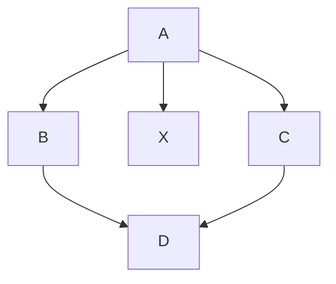
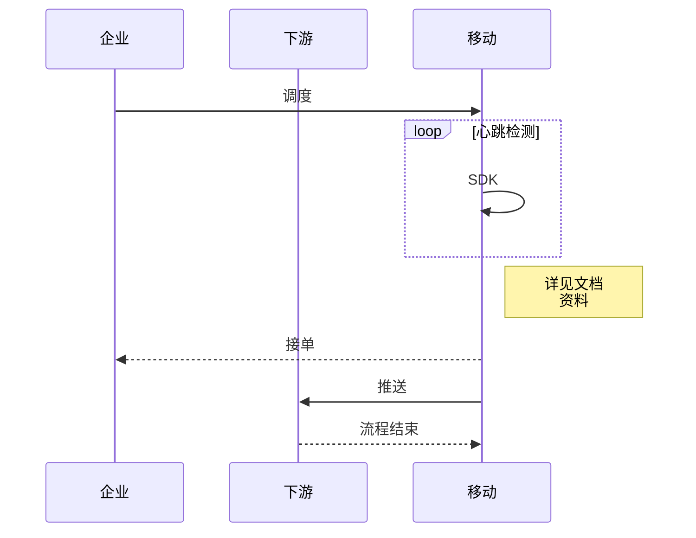
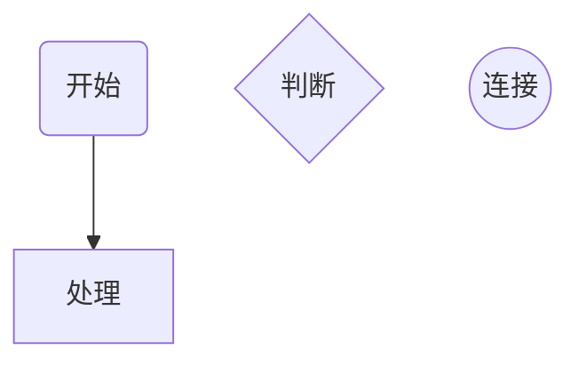
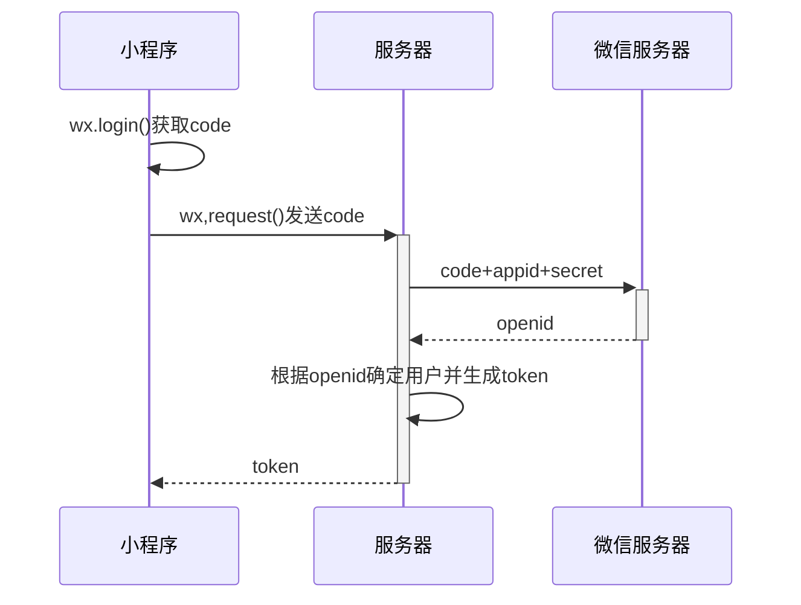

```mermaid
graph TD;
A-->B;
A-->X;
A-->C;
B-->D;
C-->D;
```

```mermaid
sequenceDiagram
    participant 企业
    participant 下游
    企业->>移动:调度
    loop 心跳检测
        移动->>移动:SDK
    end
    note right of 移动:详见文档<br/>资料
    移动-->>企业:接单
    移动->>下游:推送
    下游-->>移动:流程结束
```

```mermaid
graph TB
    A(开始)
    B[处理]
    C{判断}
    D((连接))
    A-->B
   
```

```mermaid
sequenceDiagram
    小程序->>小程序:wx.login()获取code
    小程序->>+ 服务器:wx,request()发送code
    服务器->>+微信服务器:code+appid+secret
    微信服务器-->>-服务器:openid
    服务器->>服务器:根据openid确定用户并生成token
    服务器-->>-小程序:token
```