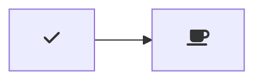
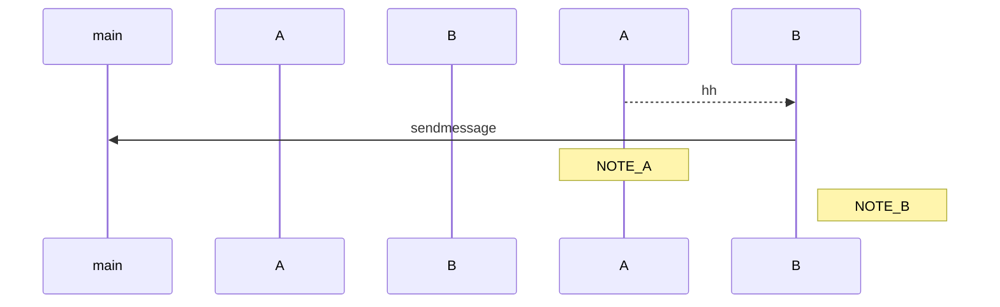
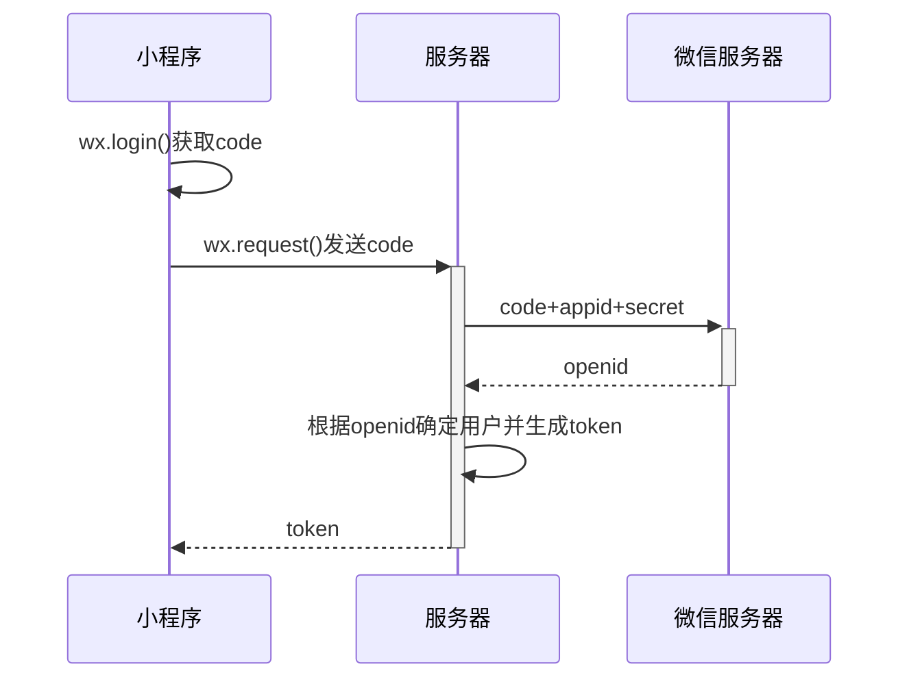

```mermaid
graph TD;
    A-->B;
    A-->C;
    B-->D;
    C-->D;
```

```mermaid
graph LR
    fa:fa-check-->fa:fa-coffee
```

```mermaid
sequenceDiagram
    participant main
    participant FuncA as A
    participant FuncB as B 
    A-->>B:hh
    B->>main:sendmessage
    Note over A:NOTE_A
    Note right of B:NOTE_B
```

```mermaid
sequenceDiagram
    小程序 ->> 小程序 : wx.login()获取code
    小程序 ->> + 服务器 : wx.request()发送code
    服务器 ->> + 微信服务器 : code+appid+secret
    微信服务器 -->> - 服务器 : openid
    服务器 ->> 服务器 : 根据openid确定用户并生成token
    服务器 -->> - 小程序 : token
```